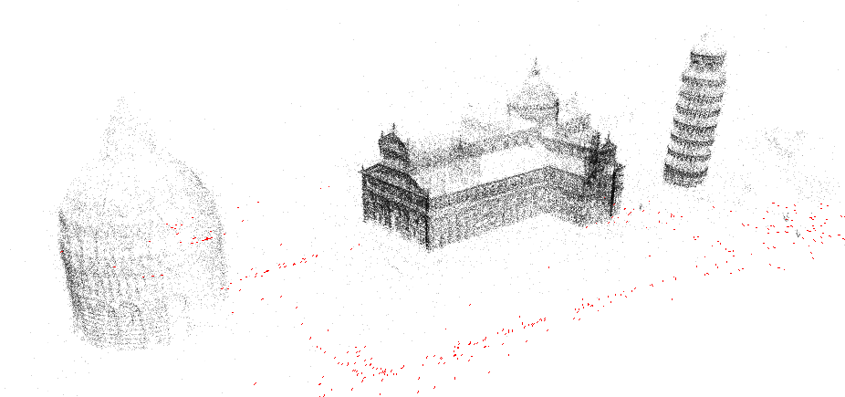
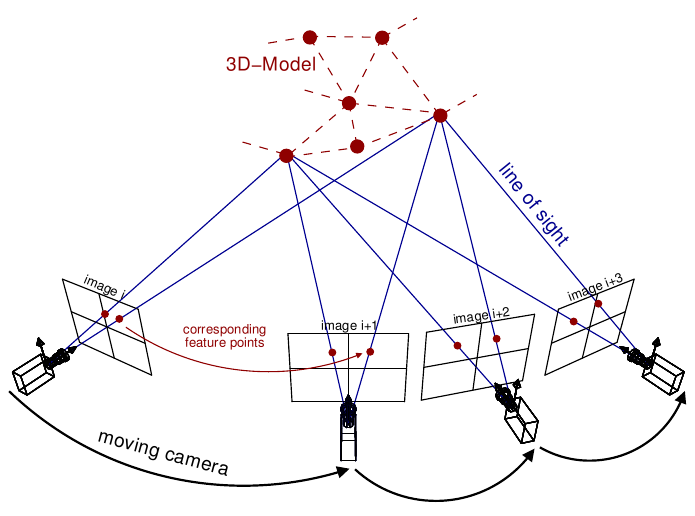
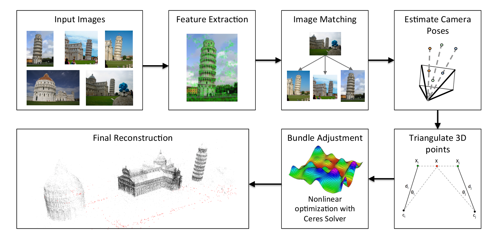
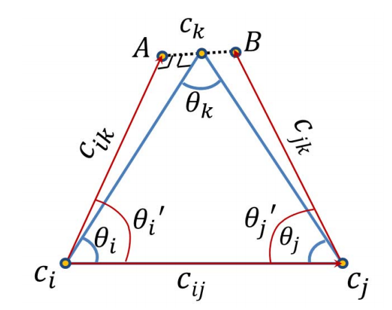

.. highlight:: c++

.. default-domain:: cpp

.. _`chapter-sfm`:

===========================
Structure from Motion (SfM)
===========================

Theia has a full Structure-from-Motion pipeline that is extremely efficient. Our
overall pipeline consists of several steps. First, we extract features (SIFT is
the default). Then, we perform two-view matching and geometric verification to
obtain relative poses between image pairs and create a :class:`ViewGraph`. Next,
we perform either incremental or global SfM.

  #. Extract features in images.
  #. Match features to obtain image correspondences.
  #. Estimate camera poses from two-view matches and geometries using
     incremental or global SfM.

Incremental SfM is the standard approach that adds on one image at a time to
grow the reconstruction. While this method is robust, it is not scalable because
it requires repeated operations of expensive bundle adjustment. Global SfM is
different from incremental SfM in that it considers the entire view graph at the
same time instead of incrementally adding more and more images to the
:class:`Reconstruction`. Global SfM methods have been proven to be very fast
with comparable or better accuracy to incremental SfM approaches (See
[JiangICCV]_, [MoulonICCV]_, [WilsonECCV2014]_), and they are much more readily
parallelized. After we have obtained camera poses, we perform triangulation and
:class:`BundleAdjustment` to obtain a valid 3D reconstruction consisting of
cameras and 3D points.

First, we will describe the fundamental classes of our SfM pipeline:

  * :class:`View`, the main class encapsulating an image, its pose, and which features it observes
  * :class:`Camera`, a member of the :class:`View` class containing pose information
  * :class:`Track`, a 3D point and information about which cameras observe it
  * :class:`Reconstruction`, the core SfM class containing a set of :class:`View` and :class:`Track` object
  * :class:`ViewGraph` containing matching information and relative pose information between :class:`View` objects
  * :class:`TwoViewInfo`, containing relative pose information between two views.

Then, we will describe the various SfM pipelines in Theia.

Core Classes and Data Structures
================================

Views and Tracks
----------------

.. class:: View

At the heart of our SfM framework is the :class:`View` class which represents
everything about an image that we want to reconstruct. It contains information
about features from the image, camera pose information, and EXIF
information. Views make up our basic visibility constraints and are a fundamental
part of the SfM pipeline.

.. class:: Track

A :class:`Track` represents a feature that has been matched over potentially
many images. When a feature appears in multiple images it typically means that
the features correspond to the same 3D point. These 3D points are useful
constraints in SfM reconstruction, as they represent the "structure" in
"Structure-from-Motion" and help to build a point cloud for our reconstruction.

Camera
------

.. class:: Camera

Each :class:`View` contains a :class:`Camera` object that contains intrinsic and
extrinsic information about the camera that observed the scene. Theia has an
efficient, compact :class:`Camera` class that abstracts away common image
operations. This greatly relieves the pain of manually dealing with calibration
and geometric transformations of images. We represent camera intrinsics such
that the calibration matrix is:

.. math::

  K = \left[\begin{matrix}f & s & p_x \\ 0 & f * a & p_y \\ 0 & 0 & 1 \end{matrix} \right]

where :math:`f` is the focal length (in pixels), :math:`s` is the skew,
:math:`a` is the aspect ratio and :math:`p` is the principle point of the
camera. All of these intrinsics may be accessed with getter and setter methods,
e.g., :code:`double GetFocalLength()` or :code:`void SetFocalLength(const double
focal_length)`. Note that we do additionally allow for up to two radial
distortion parameters, but these are not part of the calibration matrix so they
must be set or retrieved separately from the corresponding getter/setter
methods.

We store the camera pose information as the transformation which maps world
coordinates into camera coordinates. Our rotation is stored internally as an
`SO(3)` rotation, which makes optimization with :class:`BundleAdjustment` more
effective since the value is always a valid rotation (unlike e.g., Quaternions
that must be normalized after each optimization step). However, for convenience
we provide an interface to retrieve the rotation as a rotation matrix as
well. Further, we store the camera position as opposed to the translation.

The convenience of this camera class is clear with the common example of 3D
point reprojection.

.. code:: c++

   // Open an image and obtain camera parameters.
   FloatImage image("my_image.jpg");
   double focal_length;
   CHECK(image.FocalLengthPixels(&focal_length));
   const double radial_distortion1 = value obtained elsewhere...
   const double radial_distortion2 = value obtained elsewhere...
   const Eigen::Matrix3d rotation = value obtained elsewhere...
   const Eigen::Vector3d position = value obtained elsewhere...

   // Set up the camera.
   Camera camera;
   camera.SetOrientationFromRotationMatrix(rotation);
   camera.SetPosition(position);
   camera.SetFocalLength(focal_length);
   camera.SetPrincipalPoint(image.Width() / 2.0, image.Height() / 2.0);
   camera.SetRadialDistortion(radial_distortion1, radial_distortion2);

   // Obtain a homogeneous 3D point
   const Eigen::Vector4d homogeneous_point3d = value obtained elsewhere...

   // Reproject the 3D point to a pixel.
   Eigen::Vector2d reprojection_pixel;
   const double depth = camera.ProjectPoint(homogeneous_point3d, &pixel);
   if (depth < 0) {
     LOG(INFO) << "Point was behind the camera!";
   }

   LOG(INFO) << "Homogeneous 3D point: " << homogeneous_point3d
             << " reprojected to the pixel value of " << reprojection_pixel;

Point projection can be a tricky function when considering the camera intrinsics
and extrinsics. Theia takes care of this projection (including radial
distortion) in a simple and efficient manner.

In addition to typical getter/setter methods for the camera parameters, the
:class:`Camera` class also defines several helper functions:.

.. function:: bool Camera::InitializeFromProjectionMatrix(const int image_width, const int image_height, const Matrix3x4d projection_matrix)

    Initializes the camera intrinsic and extrinsic parameters from the
    projection matrix by decomposing the matrix with a RQ decomposition.

    .. NOTE:: The projection matrix does not contain information about radial
        distortion, so those parameters will need to be set separately.

.. function:: void Camera::GetProjectionMatrix(Matrix3x4d* pmatrix) const

    Returns the projection matrix. Does not include radial distortion.

.. function:: void Camera::GetCalibrationMatrix(Eigen::Matrix3d* kmatrix) const

    Returns the calibration matrix in the form specified above.

.. function:: Eigen::Vector3d Camera::PixelToUnitDepthRay(const Eigen::Vector2d& pixel) const

    Converts the pixel point to a ray in 3D space such that the origin of the
    ray is at the camera center and the direction is the pixel direction rotated
    according to the camera orientation in 3D space. The returned vector is not
    unit length.

Reconstruction
--------------

.. class:: Reconstruction

At the core of our SfM pipeline is an SfM :class:`Reconstruction`. A
:class:`Reconstruction` is the representation of a 3D reconstruction consisting
of a set of unique :class:`Views` and :class:`Tracks`. More importantly, the
:class:`Reconstruction` class contains visibility information relating all of
the Views and Tracks to each other. We identify each :class:`View` uniquely
based on the name (a string). A good name for the view is the filename of the
image that corresponds to the :class:`View`

When creating an SfM reconstruction, you should add each :class:`View` and
:class:`Track` through the :class:`Reconstruction` object. This will ensure that
visibility information (such as which Tracks are observed a given View and which
Views see a given Track) stays accurate. Views and Tracks are given a unique ID
when added to the :class:`Reconstruction` to help make use of these structures
lightweight and efficient.

.. function:: ViewId Reconstruction::AddView(const std::string& view_name)

    Adds a view to the reconstruction with the default initialization. The ViewId
    returned is guaranteed to be unique or will be kInvalidViewId if the method
    fails. Each view is uniquely identified by the view name (a good view name could
    be the filename of the image).

.. function:: bool Reconstruction::RemoveView(const ViewId view_id)

    Removes the view from the reconstruction and removes all references to the view in
    the tracks.

    .. NOTE:: Any tracks that have length 0 after the view is removed will also be removed.

.. function:: int Reconstruction::NumViews() const
.. function:: int Reconstruction::NumTracks() const

.. function:: const View* Reconstruction::View(const ViewId view_id) const
.. function:: View* Reconstruction::MutableView(const ViewId view_id)

    Returns the View or a nullptr if the track does not exist.

.. function:: std::vector<ViewId> Reconstruction::ViewIds() const

    Return all ViewIds in the reconstruction.

.. function:: ViewId Reconstruction::ViewIdFromName(const std::string& view_name) const

    Returns to ViewId of the view name, or kInvalidViewId if the view does not
    exist.

.. function:: TrackId Reconstruction::AddTrack(const std::vector<std::pair<ViewId, Feature> >& track)

    Add a track to the reconstruction with all of its features across views that observe
    this track. Each pair contains a feature and the corresponding ViewId
    that observes the feature. A new View will be created if
    a View with the view name does not already exist. This method will not
    estimate the position of the track. The TrackId returned will be unique or
    will be kInvalidTrackId if the method fails.

.. function:: bool Reconstruction::RemoveTrack(const TrackId track_id)

    Removes the track from the reconstruction and from any Views that observe this
    track. Returns true on success and false on failure (e.g., the track does
    not exist).

.. function:: const Track* Reconstruction::Track(const TrackId track_id) const
.. function:: Track* Reconstruction::MutableTrack(const TrackId track_id)

    Returns the Track or a nullptr if the track does not exist.

.. function:: std::vector<TrackId> Reconstruction::TrackIds() const

    Return all TrackIds in the reconstruction.

ViewGraph
---------

.. class:: ViewGraph

A :class:`ViewGraph` is a basic SfM construct that is created from two-view
matching information. Any pair of views that have a view correlation form an
edge in the :class:`ViewGraph` such that the nodes in the graph are
:class:`View` that are connected by :class:`TwoViewInfo` objects that contain
information about the relative pose between the Views as well as matching
information.

Once you have a set of views and match information, you can add them to the view graph:

.. code:: c++

  std::vector<View> views;
  // Match all views in the set.
  std::vector<ViewIdPair, TwoViewInfo> view_pair_matches;

  ViewGraph view_graph;
  for (const auto& view_pair : view_pair_matches) {
    const ViewIdPair& view_id_pair = view_pair.first;
    const TwoViewInfo& two_view_info = view_pair.second;
    // Only add view pairs to the view graph if they have strong visual coherence.
    if (two_view_info.num_matched_features > min_num_matched_features) {
      view_graph.AddEdge(views[view_id_pair.first],
                         views[view_id_pair.second],
                         two_view_info);
    }
  }

  // Process and/or manipulate the view graph.

The edge values are especially useful for one-shot SfM where the relative poses
are heavily exploited for computing the final poses. Without a proper
:class:`ViewGraph`, one-shot SfM would not be possible.

TwoViewInfo
-----------

.. class:: TwoViewInfo

After image matching is performed we can create a :class:`ViewGraph` that
explains the relative pose information between two images that have been
matched. The :class:`TwoViewInfo` struct is specified as:

.. code:: c++

  struct TwoViewInfo {
    double focal_length_1;
    double focal_length_2;

    Eigen::Vector3d position_2;
    Eigen::Vector3d rotation_2;

    // Number of features that were matched and geometrically verified betwen the
    // images.
    int num_verified_matches;
  };

This information serves the purpose of an edge in the view graph that describes
visibility information between all views. The relative poses here are used to
estimate global poses for the cameras.

Building a Reconstruction
=========================

Theia implements a generic interface for estimating a :class:`Reconstruction`
with the :class:`ReconstructionEstimator`. This class takes in as input a
:class:`ViewGraph` with connectivity and relative pose information, and a
:class:`Reconstruction` with view and track information and unestimated poses
and 3d points. All SfM pipelines are derived directly from the
:class:`ReconstructionEstimator` class. This allows for a consistent interface
and also the ability to choose the reconstruction pipeline at run-time.

However, the most common use case for SfM pipelines is to input images and
output SfM reconstructions. As such, Theia implements a
:class:`ReconstructionBuilder` utility class. The high-level responsibilities of
these classes are:

  * :class:`ReconstructionBuilder` takes as input either images or a set of
    pre-computed matches (computed with Theia or any other technique). If images
    are passed in, users may choose the type of feature, feature matching
    strategy, and more. After matches are computed, the
    :class:`ReconstructionBuilder` can call a :class:`ReconstructionEstimator`
    to compute an SfM Reconstruction
  * :class:`ReconstructionEstimator` is the abstract interface for classes that
    estimate SfM reconstructions. Derived classes implement techniques such as
    incremental SfM or global SfM, and may be easily extended for new type of
    SfM pipelines. This class is called by the :class:`ReconstructionBuilder`
    (see below) to estimate an SfM reconstruction from images and/or feature
    matches.

.. class:: ReconstructionBuilder

.. function:: ReconstructionBuilder::ReconstructionBuilder(const ReconstructionBuilderOptions& options)

.. function:: bool ReconstructionBuilder::AddImage(const std::string& image_filepath)

  Add an image to the reconstruction.

.. function:: bool ReconstructionBuilder::AddImageWithCameraIntrinsicsPrior(const std::string& image_filepath, const CameraIntrinsicsPrior& camera_intrinsics_prior)

   Same as above, but with the camera priors manually specified. This is useful
   when calibration or EXIF information is known ahead of time. Note, if the
   CameraIntrinsicsPrior is not explicitly set, Theia will attempt to extract
   EXIF information for camera intrinsics.

.. function:: bool ReconstructionBuilder::AddTwoViewMatch(const std::string& image1, const std::string& image2, const ImagePairMatch& matches)

  Add a match to the view graph. Either this method is repeatedly called or
  ExtractAndMatchFeatures must be called. You may obtain a vector of
  ImagePairMatch from a Theia match file or from another custom form of
  matching.

.. function:: bool ReconstructionBuilder::ExtractAndMatchFeatures()

  Extracts features and performs matching with geometric verification. Images
  must have been previously added with the ``AddImage`` or
  ``AddImageWithCameraIntrinsicsPrior``.

.. function:: void ReconstructionBuilder::InitializeReconstructionAndViewGraph(Reconstruction* reconstruction, ViewGraph* view_graph)

  Initializes the reconstruction and view graph explicitly. This method
  should be used as an alternative to the Add* methods.

  .. NOTE:: The ReconstructionBuilder takes ownership of the reconstruction and view graph.

.. function:: bool ReconstructionBuilder::BuildReconstruction(std::vector<Reconstruction*>* reconstructions)

  Estimates a Structure-from-Motion reconstruction using the specified
  ReconstructionEstimator that was set in the
  ``reconstruction_estimator_options`` field (see below). Once a reconstruction
  has been estimated, all views that have been successfully estimated are added
  to the output vector and we estimate a reconstruction from the remaining
  unestimated views. We repeat this process until no more views can be
  successfully estimated, so each :class:`Reconstruction` object in the output
  vector is an independent reconstruction of the scene.

Setting the ReconstructionBuilder Options
-----------------------------------------

.. class:: ReconstructionBuilderOptions

The :class:`ReconstructionBuilder` has many customizable options that can easily
be set to modify the functionality, strategies, and performance of the SfM
reconstruction process. This includes options for feature description
extraction, feature matching, which SfM pipeline to use, and more.

.. member:: int ReconstructionBuilderOptions::num_threads

  DEFAULT: ``1``

  Number of threads used. Each stage of the pipeline (feature extraction,
  matching, estimation, etc.) will use this number of threads.

.. member:: bool ReconstructionBuilderOptions::reconstruct_largest_connected_component

  DEFAULT: ``false``

  By default, the ReconstructionBuilder will attempt to reconstruct as many
  models as possible from the input data. If set to true, only the largest
  connected component is reconstructed.

.. member:: bool ReconstructionBuilderOptions::only_calibrated_views

  DEFAULT: ``false``

  Set to true to only accept calibrated views (from EXIF or elsewhere) as
  valid inputs to the reconstruction process. When uncalibrated views are
  added to the reconstruction builder they are ignored with a LOG warning.

.. member:: int ReconstructionBuilderOptions::max_track_length

  DEFAULT: ``20``

  Maximum allowable track length. Tracks that are too long are exceedingly
  likely to contain outliers. Any tracks that are longer than this will be split
  into multiple tracks.

.. member:: int ReconstructionBuilderOptions::min_num_inlier_matches

  DEFAULT: ``30``

  Minimum number of geometrically verified inliers that a view pair must have
  in order to be considered a good match.

.. member:: DescriptorExtractorType ReconstructionBuilderOptions::descriptor_type

  DEFAULT: ``DescriptorExtractorType::SIFT``

  Descriptor type for extracting features.
  See `//theia/image/descriptor/create_descriptor_extractor.h
  <https://github.com/sweeneychris/TheiaSfM/blob/master/src/theia/image/descriptor/create_descriptor_extractor.h>`_

.. member:: SiftParameters ReconstructionBuilderOptions::sift_parameters

  If the desired descriptor type is SIFT then these are the sift parameters
  controlling keypoint detection and description options. See
  `//theia/image/keypoint_detector/sift_parameters.h
  <https://github.com/sweeneychris/TheiaSfM/blob/master/src/theia/image/keypoint_detector/sift_parameters.h>`_

.. member:: MatchingStrategy ReconstructionBuilderOptions::matching_strategy

  DEFAULT: ``MatchingStrategy::BRUTE_FORCE``

  Matching strategy type. Current the options are ``BRUTE_FORCE`` or ``CASCADE_HASHING``
  See `//theia/matching/create_feature_matcher.h
  <https://github.com/sweeneychris/TheiaSfM/blob/master/src/theia/matching/create_feature_matcher.h>`_

.. member:: FeatureMatcherOptions ReconstructionBuilderOptions::matching_options

  Options for computing matches between images. See
  :class:`FeatureMatcherOptions` for more details.

.. member:: VerifyTwoViewMatchesOptions ReconstructionBuilderOptions::geometric_verification_options

  Settings for estimating the relative pose between two images to perform
  geometric verification.  See `//theia/sfm/verify_two_view_matches.h
  <https://github.com/sweeneychris/TheiaSfM/blob/master/src/theia/sfm/verify_two_view_matches.h>`_

.. member:: ReconstructionEstimatorOptions ReconstructionBuilderOptions::reconstruction_estimator_options

   Setting for the SfM estimation. The full list of
   :class:`ReconstructionEstimatorOptions` may be found below.

.. member:: std::string ReconstructionBuilderOptions::output_matches_file

  If you want the matches to be saved, set this variable to the filename that
  you want the matches to be written to. Image names, inlier matches, and
  view metadata so that the view graph and tracks may be exactly
  recreated.

The Reconstruction Estimator
============================

.. class:: ReconstructionEstimator

This is the base class for which all SfM reconstruction pipelines derive
from. Whereas the :class:`ReconstructionBuilder` focuses on providing an
end-to-end interface for SfM, the :class:`ReconstructionEstimator` focuses
solely on the SfM estimation. That is, it takes a viewing graph with matching
and visibility information as input and outputs a fully estimated 3D model.

The :class:`ReconstructionEstimator` is an abstract interface, and each of the
various SfM pipelines derive directly from this class. This allows us to easily
implement e.g., incremental or global SfM pipelines with a clean, consistent
interface while also allowing polymorphism so that type of SfM pipeline desired
may easily be chosen at run-time.

.. function:: ReconstructionEstimator::ReconstructionEstimator(const ReconstructorEstimatorOptions& options)

.. function:: ReconstructionEstimatorSummary ReconstructionEstimator::Estimate(const ViewGraph& view_graph, Reconstruction* reconstruction)

  Estimates the cameras poses and 3D points from a view graph. The derived
  classes must implement this method to estimate a 3D reconstruction.

.. function:: static ReconstructionEstimator* ReconstructionEstimator::Create(const ReconstructionEstimatorOptions& options)

   Creates a derived :class:`ReconstructionEstimator` class from the options
   passed in. For instance, an :class:`IncrementalReconstructionEstimator` will
   be returned if incremental SfM is desired.

Setting Reconstruction Estimator Options
----------------------------------------

.. class:: ReconstructorEstimatorOptions

There are many, many parameters and options to choose from and tune while
performing SfM. All of the available parameters may be set as part of the
:class:`ReconstructionEstimatorOptions` that are required in the
:class:`ReconstructionEstimator` constructor. The documentation here attempts to
provide the high-level summary of these options; however, you should look at the
header `//theia/sfm/reconstruction_estimator_options.h
<https://github.com/sweeneychris/TheiaSfM/blob/master/src/theia/sfm/reconstruction_estimator_options.h>`_ file for a fully detailed
description of these options.

.. member:: ReconstructionEstimatorType ReconstructorEstimatorOptions::reconstruction_estimator_type

  DEFAULT: ``ReconstructionEstimatorType::GLOBAL``

  Type of reconstruction estimation to use. Options are
  ``ReconstructionEstimatorType::GLOBAL`` or
  ``ReconstructionEstimatorType::INCREMENTAL``. Incremental SfM is the standard
  sequential SfM (see below) that adds on one image at a time to gradually grow
  the reconstruction. This method is robust but not scalable. Global SfM, on the
  other hand, is very scalable but is considered to be not as robust as
  incremental SfM. This is not a limitation of the Theia implementations, but a
  currently fundamental limitation of Global SfM pipelines in general.

.. member:: GlobalRotationEstimationType ReconstructorEstimatorOptions::global_rotation_estimator_type

   DEFAULT: ``GlobalRotationEstimatorType::ROBUST_L1L2``

   If the Global SfM pipeline is used, this parameter determines which type of global rotations solver is used. Options are ``GlobalRotationEstimatorType::ROBUST_L1L2``, ``GlobalRotationEstimatorType::NONLINEAR`` and ``GlobalRotationEstimatorType::LINEAR``. See below for more details on the various global rotations solvers.

.. member:: GlobalPositionEstimationType ReconstructorEstimatorOptions::global_position_estimator_type

   DEFAULT: ``GlobalPositionEstimatorType::NONLINEAR``

   If the Global SfM pipeline is used, this parameter determines which type of global position solver is used. Options are ``GlobalPositionEstimatorType::NONLINEAR``, ``GlobalPositionEstimatorType::LINEAR_TRIPLET`` and ``GlobalPositionEstimatorType::LEAST_UNSQUARED_DEVIATION``. See below for more details on the various global positions solvers.

.. member:: int ReconstructorEstimatorOptions::num_threads

  DEFAULT: ``1``

  Number of threads to use during the various stages of reconstruction.

.. member:: double ReconstructorEstimatorOptions::max_reprojection_error_in_pixels

  DEFAULT: ``5.0``

  Maximum reprojection error. This is used to determine inlier correspondences
  for absolute pose estimation. Additionally, this is the threshold used for
  filtering outliers after bundle adjustment.

.. member:: int ReconstructorEstimatorOptions::min_num_two_view_inliers

  DEFAULT: ``30``

  Any edges in the view graph with fewer than this many inliers will be removed
  prior to any SfM estimation.

.. member:: int ReconstructorEstimatorOptions::num_retriangulation_iterations

  DEFAULT: ``1``

  After computing a model and performing an initial BA, the reconstruction can
  be further improved (and even densified) if we attempt to retriangulate any
  tracks that are currently unestimated. For each retriangulation iteration we
  do the following:

  #. Remove features that are above max_reprojection_error_in_pixels.
  #. Triangulate all unestimated tracks.
  #. Perform full bundle adjustment.

.. member:: double ReconstructorEstimatorOptions::ransac_confidence

  DEFAULT: ``0.9999``

  Confidence using during RANSAC. This determines the quality and termination
  speed of RANSAC.

.. member:: int ReconstructorEstimatorOptions::ransac_min_iterations

  DEFAULT: ``50``

  Minimum number of iterations for RANSAC.

.. member:: int ReconstructorEstimatorOptions::ransac_max_iterations

  DEFAULT: ``1000``

  Maximum number of iterations for RANSAC.

.. member:: bool ReconstructorEstimatorOptions::ransac_use_mle

  DEFAULT: ``true``

  Using the MLE quality assessment (as opposed to simply an inlier count) can
  improve the quality of a RANSAC estimation with virtually no computational
  cost.

.. member:: double ReconstructorEstimatorOptions::max_rotation_error_in_view_graph_cycles

  DEFAULT: ``3.0``

  Before orientations are estimated, some "bad" edges may be removed from the
  view graph by determining the consistency of rotation estimations in loops
  within the view graph. By examining loops of size 3 (i.e., triplets) the
  concatenated relative rotations should result in a perfect identity
  rotation. Any edges that break this consistency may be removed prior to
  rotation estimation.

.. member:: double ReconstructorEstimatorOptions::rotation_filtering_max_difference_degrees

  DEFAULT: ``5.0``

  After orientations are estimated, view pairs may be filtered/removed if the
  relative rotation of the view pair differs from the relative rotation formed
  by the global orientation estimations. That is, measure the angular distance
  between :math:`R_{i,j}` and :math:`R_j * R_i^T` and if it greater than
  ``rotation_filtering_max_difference_degrees`` than we remove that view pair
  from the graph. Adjust this threshold to control the threshold at which
  rotations are filtered.

.. member:: bool ReconstructorEstimatorOptions::refine_relative_translations_after_rotation_estimation

  DEFAULT: ``true``

  Refine the relative translations based on the epipolar error and known
  rotation estimations. This can improve the quality of the translation
  estimation.

.. member:: bool ReconstructorEstimatorOptions::extract_maximal_rigid_subgraph

  DEFAULT: ``false``

  If true, the maximal rigid component of the viewing graph will be extracted
  using the method of [KennedyIROS2012]_. This means that only the cameras that
  are well-constrained for position estimation will be used. This method is
  somewhat slow, so enabling it will cause a performance hit in terms of
  efficiency.

.. member:: bool ReconstructorEstimatorOptions::filter_relative_translations_with_1dsfm

  DEFAULT: ``true``

  If true, filter the pairwise translation estimates to remove potentially bad
  relative poses with the 1DSfM filter of [WilsonECCV2014]_. Removing potential
  outliers can increase the performance of position estimation.

.. member:: int ReconstructorEstimatorOptions::translation_filtering_num_iterations

  DEFAULT: ``48``

  The number of iterations that the 1DSfM filter runs for.

.. member:: double ReconstructorEstimatorOptions::translation_filtering_projection_tolerance

  DEFAULT: ``0.1``

  A tolerance for the 1DSfM filter. Each relative translation is assigned a cost
  where the higher the cost, the more likely a relative translation is to be an
  outlier. Increasing this threshold makes the filtering more lenient, and
  decreasing it makes it more strict.

.. member:: double ReconstructorEstimatorOptions::rotation_estimation_robust_loss_scale

  DEFAULT: ``0.1``

  Robust loss function width for nonlinear rotation estimation.

.. member:: NonlinearPositionEstimator::Options nonlinear_position_estimator_options

   The position estimation options used for the nonlinear position estimation
   method. See below for more details.

.. member:: LinearPositionEstimator::Options linear_triplet_position_estimator_options

   The position estimation options used for the linear position estimation
   method. See below for more details.

.. member:: LeastUnsquaredDeviationPositionEstimator::Options least_unsquared_deviation_position_estimator_options

   The position estimation options used for the robust least unsquare deviation
   position estimation method. See below for more details.

.. member:: double ReconstructorEstimatorOptions::multiple_view_localization_ratio

  DEFAULT: ``0.8``

  **Used for incremental SfM only.** If M is the maximum number of 3D points observed
  by any view, we want to localize all views that observe > M *
  multiple_view_localization_ratio 3D points. This allows for multiple
  well-conditioned views to be added to the reconstruction before needing bundle
  adjustment.

.. member::  double ReconstructionEstimatorOptions::absolute_pose_reprojection_error_threshold

  DEFAULT: ``8.0``

  **Used for incremental SfM only.** When adding a new view to the current
  reconstruction, this is the reprojection error that determines whether a 2D-3D
  correspondence is an inlier during localization.

.. member:: int ReconstructionEstimatorOptions::min_num_absolute_pose_inliers

  DEFAULT: ``30``

  **Used for incremental SfM only.** Minimum number of inliers for absolute pose
  estimation to be considered successful.

.. member:: double ReconstructionEstimatorOptions::full_bundle_adjustment_growth_percent

  DEFAULT: ``5.0``

  **Used for incremental SfM only.** Bundle adjustment of the entire
  reconstruction is triggered when the reconstruction has grown by more than
  this percent. That is, if we last ran BA when there were K views in the
  reconstruction and there are now N views, then G = (N - K) / K is the percent
  that the model has grown. We run bundle adjustment only if G is greater than
  this variable. This variable is indicated in percent so e.g., 5.0 = 5%.

.. member:: int ReconstructionEstimatorOptions::partial_bundle_adjustment_num_views

  DEFAULT: ``20``

  **Used for incremental SfM only.** During incremental SfM we run "partial"
  bundle adjustment on the most recent views that have been added to the 3D
  reconstruction. This parameter controls how many views should be part of the
  partial BA.

.. member:: double ReconstructorEstimatorOptions::min_triangulation_angle_degrees

  DEFAULT: ``3.0``

  In order to triangulate features accurately, there must be a sufficient
  baseline between the cameras relative to the depth of the point. Points with a
  very high depth and small baseline are very inaccurate. We require that at
  least one pair of cameras has a sufficient viewing angle to the estimated
  track in order to consider the estimation successful.

.. member:: bool ReconstructorEstimatorOptions::bundle_adjust_tracks

  DEFAULT: ``true``

  Bundle adjust a track immediately after estimating it.

.. member:: double ReconstructorEstimatorOptions::triangulation_max_reprojection_error_in_pixels

  DEFAULT: ``10.0``

  The reprojection error to use for determining a valid triangulation. If the
  reprojection error of any observation is greater than this value then we can
  consider the triangluation unsuccessful.

.. member:: LossFunctionType ReconstructionEstimatorOptions::bundle_adjustment_loss_function_type

  DEFAULT: ``LossFunctionType::TRIVIAL``

  A `robust cost function
  <http://ceres-solver.org/nnls_modeling.html#instances>`_ may be used during
  bundle adjustment to increase robustness to noise and outliers during
  optimization.

.. member:: double ReconstructionEstimatorOptions::bundle_adjustment_robust_loss_width

  DEFAULT: ``10.0``

  If a robust cost function is used, this is the value of the reprojection error
  at which robustness begins.

.. member:: int ReconstructorEstimatorOptions::min_cameras_for_iterative_solver

  DEFAULT: ``1000``

  Use SPARSE_SCHUR for problems smaller than this size and ITERATIVE_SCHUR
  for problems larger than this size.

.. member:: bool ReconstructorEstimatorOptions::constant_camera_intrinsics

  DEFAULT: ``false``

  If true, the camera intrinsic parameters (i.e., focal length, principal point,
  radial distortion, etc.) will not be modified during SfM. If accurate
  calibration is known ahead of time then it is recommended to set the camera
  intrinsics constant.

Incremental SfM Pipeline
========================

The incremental SfM pipeline follows very closely the pipelines of `Bundler
<http://www.cs.cornell.edu/~snavely/bundler/>`_ [PhotoTourism]_ and `VisualSfM
<http://ccwu.me/vsfm/>`_ [VisualSfM]_. The method begins by first estimating the
3D structure and camera poses of 2 cameras based on their relative pose. Then
additional cameras are added on sequentially and new 3D structure is estimated
as new parts of the scene are observed. Bundle adjustment is repeatedly
performed as more cameras are added to ensure high quality reconstructions and
to avoid drift.

The incremental SfM pipeline is as follows:
  #. Choose an initial camera pair to reconstruct.
  #. Estimate 3D structure of the scene.
  #. Bundle adjustment on the 2-view reconstruction.
  #. Localize a new camera to the current 3D points. Choose the camera that
     observes the most 3D points currently in the scene.
  #. Estimate new 3D structure.
  #. Bundle adjustment if the model has grown by more than 5% since the last
     bundle adjustment.
  #. Repeat steps 4-6 until all cameras have been added.

Incremental SfM is generally considered to be more robust than global SfM
methods; however, it requires many more instances of bundle adjustment (which
is very costly) and so incremental SfM is not as efficient or scalable.

To use the Incremental SfM pipeline, simply set the
``reconstruction_estimator_type`` to
``ReconstructionEstimatorType::INCREMENTAL``. There are many more options that
may be set to tune the incremental SfM pipeline that can be found in the
:class:`ReconstructionEstimatorOptions`.

Global SfM Pipeline
===================

The global SfM pipelines in Theia follow a general procedure of filtering
outliers and estimating camera poses or structure. Removing outliers can help
increase performance dramatically for global SfM, though robust estimation
methods are still required to obtain good results. The general pipeline is as
follows:

  #. Create the initial view graph from 2-view matches and :class:`TwoViewInfo`
     that describes the relative pose between matched images.
  #. Filter initial view graph and remove outlier 2-view matches.
  #. Calibrate internal parameters of all cameras (either from EXIF or another
     calibration method).
  #. Estimate global orientations of each camera with a :class:`RotationEstimator`
  #. Filter the view graph: remove any TwoViewInfos where the relative rotation
     does not agree with the estimated global rotations.
  #. Refine the relative translation estimation to account for the estimated
     global rotations.
  #. Filter any bad :class:`TwoViewInfo` based on the relative translations.
  #. Estimate the global positions of all cameras from the estimated rotations
     and :class:`TwoViewInfo` using a :class:`PositionEstimator`
  #. Estimate 3D points.
  #. Bundle adjust the reconstruction.
  #. (Optional) Attempt to estimate any remaining 3D points and bundle adjust again.

The steps above describe the general framework for global SfM, but there are
many possible ways to, for instance, estimate rotations or estimate
positions. Much work has been put into developing robust and efficient
algorithms to solve these problems and, in theory, each algorithm should be
easily inter-changeable.

Since Theia is built to be modular and extendible, we make it extremely easy to
implement and integrate new rotations solvers or positions solvers into the
global SfM framework. Theia implements a generic Global SfM interface
:class:`GlobalReconstructionEstimator` that easily encapsulates all global SfM
pipelines. The :class:`GlobalReconstructionEstimator` class makes calls to a
abstract :class:`RotationEstimator` class and abstract
:class:`PositionEstimator` class to estimate rotations and positions
respectively. Because these classes are abstract, this means we can easily
instantiate which type of solvers we want to use and are guaranteed to have the
same interface. This allows us to choose the rotation and position solvers at
run-time, making experiments with global SfM painless!

Estimating Global Rotations
---------------------------

.. class:: RotationEstimator

Theia estimates the global rotations of cameras using an abstract interface
class :class:`RotationEstimator`.

.. function:: bool RotationEstimator::EstimateRotations(const std::unordered_map<ViewIdPair, TwoViewInfo>& view_pairs, std::unordered_map<ViewId, Eigen::Vector3d>* global_orientations)

  Using the relative poses as input, this function will estimate the global
  orientations for each camera. Generally speaking, this method will attempt to
  minimize the relative pose error:

  .. math:: :label: rotation_constraint

    R_{i,j} = R_j * R_i^T`

  .. NOTE:: This function does require an initial estimate of camera orientations. Initialization may be performed by walking a minimal spanning tree on the viewing graph, or another trivial method.

Implementing a new rotations solver is extremely easy. Simply derive from the
:class:`RotationEstimator` class and implement the ``EstimateRotations`` method
and your new rotations solver will seamlessly plug into Theia's global SfM
pipeline.

There are several types of rotation estimators that Theia implements natively:

  * A Robust L1-L2 :class:`RobustRotationEstimator`
  * A nonlinear :class:`NonlinearRotationEstimator`
  * A linear :class:`LinearRotationEstimator`

:class:`RobustRotationEstimator`
^^^^^^^^^^^^^^^^^^^^^^^^^^^^^^^^

.. class:: RobustRotationEstimator

  We recommend to use the :class:`RobustRotationEstimator` of
  [ChatterjeeICCV13]_. This rotation estimator utilizes L1 minimization to
  maintain efficiency to outliers. After several iterations of L1 minimization,
  an iteratively reweighted least squares approach is used to refine the
  solution.

.. member:: int RobustRotationEstimator::Options::max_num_l1_iterations

   DEFAULT: ``5``

   Maximum number of L1 iterations to perform before performing the reweighted
   least squares minimization. Typically only a very small number of L1
   iterations are needed.

.. member:: int RobustRotationEstimator::Options::max_num_irls_iterations

   DEFAULT: ``100``

   Maximum number of reweighted least squares iterations to perform. These steps
   are much faster than the L2 iterations.

:class:`NonlinearRotationEstimator`
^^^^^^^^^^^^^^^^^^^^^^^^^^^^^^^^^^^

.. class:: NonlinearRotationEstimator

   This class minimizes equation :eq:`rotation_constraint` using nonlinear
   optimization with the Ceres Solver. The angle-axis rotation parameterization
   is used so that rotations always remain on the SO(3) rotation manifold during
   the optimization.

.. function:: NonlinearRotationEstimator::NonlinearRotationEstimator(const double robust_loss_width)

   We utilize a Huber-like cost function during the optimization to remain
   robust to outliers. This robust_loss_width determines where the robustness
   kicks in.

:class:`LinearRotationEstimator`
^^^^^^^^^^^^^^^^^^^^^^^^^^^^^^^^

.. class:: LinearRotationEstimator

   This class minimizes :eq:`rotation_constraint` using a linear
   formulation. The constraints are set up in a linear system using rotation
   matrices and the optimal rotations are solved for using a linear least
   squares minimization described by [Martinec2007]_. This minimization does not
   guarantee that the solution set will be valid rotation matrices (since it is
   finding any type of 3x3 matrices that minimize the linear system), so the
   solution is projected into the nearest SO(3) rotation matrix. As a result,
   this method is fast but may not always be the most accurate.

.. function:: LinearRotationEstimator::LinearRotationEstimator(bool weight_terms_by_inliers)

   If true, each term in the linear system will be weighted by the number of
   inliers such that two-view matches with many inliers are weighted higher in
   the linear system.

Estimating Global Positions
---------------------------

Positions of cameras may be estimated simultaneously after the rotations are
known. Since positions encapsulate direction and scale information, the problem
of estimating camera positions is fundamentally more difficult than estimating
camera rotations. As such, there has been much work that has gone into
estimating camera positions robustly and efficiently.

.. class:: PositionEstimator

Similar to the :class:`RotationEstimator` class, Theia utilizes an abstract
:class:`PositionEstimator` class to perform position estimation. This class
defines the interface that all derived classes will use for estimating camera
positions. Like with the :class:`RotationEstimator`, this abstract class helps
to keep the interface clean and allows for a simple way to change between
position estimation methods at runtime thanks to polymorphism.

.. function::  bool PositionEstimator::EstimatePositions(const std::unordered_map<ViewIdPair, TwoViewInfo>& view_pairs, const std::unordered_map<ViewId, Eigen::Vector3d>& orientation, std::unordered_map<ViewId, Eigen::Vector3d>* positions)

  Input the view pairs containing relative poses between matched geometrically
  verified views, as well as the global (absolute) orientations of the camera
  that were previously estimated. Camera positions are estimated from this
  information, with the specific strategies and implementation determined by the
  derived classes.

  Returns true if the position estimation was a success, false if there was a
  failure. If false is returned, the contents of positions are undefined.

  Generally, the position estimation methods attempt to minimize the deviation
  from the relative translations:

  .. math:: :label: position_constraint

     R_i * (c_j - c_i) = \alpha_{i,j} * t_{i,j}

  This equation is used to determine the global camera positions, where
  :math:`\alpha_{i,j} = ||c_j - c_i||^2`. This ensures that we optimize for
  positions that agree with the relative positions computed in two-view
  estimation.

:class:`NonlinearPositionEstimator`
^^^^^^^^^^^^^^^^^^^^^^^^^^^^^^^^^^^

.. class:: NonlinearPositionEstimator

This class attempts to minimize the position constraint of
:eq:`position_constraint` with a nonlinear solver that minimizes the chordal
distance [WilsonECCV2014]_. A robust cost function is utilized to remain robust
to outliers.

.. function:: NonlinearPositionEstimator(const NonlinearPositionEstimator::Options& options, const Reconstruction& reconstruction)

   The constructor takes the options for the nonlinear position estimator, as
   well as const references to the reconstruction (which contains camera and
   track information) and the two view geometry information that will be use to
   recover the positions.

.. member:: int NonlinearPositionEstimator::Options::num_threads

   DEFAULT: ``1``

   Number of threads to use with Ceres for nonlinear optimization.

.. member:: int NonlinearPositionEstimator::Options::max_num_iterations

   DEFAULT: ``400``

   The maximum number of iterations for the minimization.

.. member:: double NonlinearPositionEstimator::Options::robust_loss_width

   DEFAULT: ``0.1``

   The width of the robust Huber loss function used.

.. member:: int NonlinearPositionEstimator::Options::min_num_points_per_view

   DEFAULT: ``0``

   The number of 3D point-to-camera constraints to use for position
   recovery. Using points-to-camera constraints can sometimes improve robustness
   to collinear scenes. Points are taken from tracks in the reconstruction such
   that the minimum number of points is used such that each view has at least
   ``min_num_points_per_view`` point-to-camera constraints.

.. member:: double NonlinearPositionEstimator::Options::point_to_camera_weight

   DEFAULT: ``0.5``

   Each point-to-camera constraint (if any) is weighted by
   ``point_to_camera_weight`` compared to the camera-to-camera weights.

:class:`LinearPositionEstimator`
^^^^^^^^^^^^^^^^^^^^^^^^^^^^^^^^

.. class:: LinearPositionEstimator

For the linear position estimator of [JiangICCV]_, we utilize an approximate geometric error to determine the position locations within a triplet as shown above. The cost function we minimize is:

  .. math:: f(i, j, k) = c_k - \dfrac{1}{2} (c_i + ||c_k - c_i|| c_{ik}) + c_j + ||c_k - c_j|| c_{jk})

This can be formed as a linear constraint in the unknown camera positions :math:`c_i`. The solution that minimizes this cost lies in the null-space of the resultant linear system. Instead of extracting the entire null-space as [JiangICCV]_ does, we instead hold one camera constant at the origin and use the Inverse-Iteration Power Method to efficiently determine the null vector that best solves our minimization. This results in a dramatic speedup without sacrificing efficiency.

.. function:: LinearPositionEstimator::LinearPositionEstimator(const LinearPositionEstimator::Options& options, const Reconstruction& reconstruction)

.. member:: int LinearPositionEstimator::Options::num_threads

  DEFAULT: ``1``

  The number of threads to use to solve for camera positions

.. member:: int LinearPositionEstimator::Options::max_power_iterations

  DEFAULT: ``1000``

  Maximum number of power iterations to perform while solving for camera positions.

.. member:: double LinearPositionEstimator::Options::eigensolver_threshold

  DEFAULT: ``1e-8``

  This number determines the convergence of the power iteration method. The
  lower the threshold the longer it will take to converge.

:class:`LeastUnsquareDeviationPositionEstimator`
^^^^^^^^^^^^^^^^^^^^^^^^^^^^^^^^^^^^^^^^^^^^^^^^

.. class:: LeastUnsquaredDeviationPositionEstimator

Estimates the camera position of views given pairwise relative poses and the
absolute orientations of cameras. Positions are estimated using a least
unsquared deviations solver -- essentially an L1 solver that is wrapped in an
Iteratively Reweighted Least Squares (IRLS) formulation. This method was
proposed in [OzyesilCVPR2015]_.

.. function:: LeastUnsquaredDeviationPositionEstimator(const LeastUnsquaredDeviationPositionEstimator::Options& options, const Reconstruction& reconstruction)

   The constructor takes the options for the nonlinear position estimator, as
   well as const references to the reconstruction (which contains camera and
   track information) and the two view geometry information that will be use to
   recover the positions.

.. member:: int LeastUnsquaredDeviationPositionEstimator::Options::num_threads

   DEFAULT: ``1``

   Number of threads to use with Ceres for nonlinear optimization.

.. member:: int LeastUnsquaredDeviationPositionEstimator::Options::max_num_iterations

   DEFAULT: ``400``

   The maximum number of iterations for the minimization.

.. member:: int LeastUnsquaredDeviationPositionEstimator::Options::initialize_random_positions

   DEFAULT: ``true``

   If true, positions will be initialized to be random. If false, the position values that were passed into ``EstimatePositions`` will be used for initialization.

.. member:: int LeastUnsquaredDeviationPositionEstimator::Options::max_num_reweighted_iterations

   DEFAULT: ``10``

   The maximum number of reweighted iterations in the IRLS scheme.

.. member:: int LeastUnsquaredDeviationPositionEstimator::Options::convergence_criterion

   DEFAULT: ``1e-4``

   A measurement for determining the convergence of the IRLS scheme. Increasing
   the value will make the IRLS scheme converge earlier.

Triangulation
=============

  Triangulation in structure from motion calculates the 3D position of an image
  coordinate that has been tracked through two or more images. All cameras with
  an estimated camera pose are used to estimate the 3D point of a track.

  .. class:: EstimateTrackOptions

  .. member:: bool EstimateTrackOptions::bundle_adjustment

    DEFAULT: ``true``

    Bundle adjust the track (holding all camera parameters constant) after
    initial estimation. This is highly recommended in order to obtain good 3D
    point estimations.

  .. member:: double EstimateTrackOptions::max_acceptable_reprojection_error_pixels

    DEFAULT: ``5.0``

    Track estimation is only considered successful if the reprojection error for
    all observations is less than this value.

  .. member:: double EstimateTrackOptions::min_triangulation_angle_degrees

    DEFAULT: ``3.0``

    In order to triangulate features accurately, there must be a sufficient
    baseline between the cameras relative to the depth of the point. Points with
    a very high depth and small baseline are very inaccurate. We require that at
    least one pair of cameras has a sufficient viewing angle to the estimated
    track in order to consider the estimation successful.

  .. function:: bool EstimateAllTracks(const EstimateTrackOptions& options, const int num_threads, Reconstruction* reconstruction)

    Performs (potentially multithreaded) track estimation. Track estimation is
    embarrassingly parallel so multithreading is recommended.

  .. cpp:function:: bool Triangulate(const Matrix3x4d& pose1, const Matrix3x4d& pose2, const Eigen::Vector2d& point1, const Eigen::Vector2d& point2, Eigen::Vector4d* triangulated_point)

    2-view triangulation using the method described in [Lindstrom]_. This method
    is optimal in an L2 sense such that the reprojection errors are minimized
    while enforcing the epipolar constraint between the two
    cameras. Additionally, it basically the same speed as the
    :func:`TriangulateDLT` method.

    The poses are the (potentially calibrated) poses of the two cameras, and the
    points are the 2D image points of the matched features that will be used to
    triangulate the 3D point. On successful triangulation, ``true`` is
    returned. The homogeneous 3d point is output so that it may be known if the
    point is at infinity.

  .. function:: bool TriangulateDLT(const Matrix3x4d& pose1, const Matrix3x4d& pose2, const Eigen::Vector2d& point1, const Eigen::Vector2d& point2, Eigen::Vector4d* triangulated_point)

    The DLT triangulation method of [HartleyZisserman]_.

  .. function:: bool TriangulateMidpoint(const Eigen::Vector3d& origin1, const Eigen::Vector3d& ray_direction1, const Eigen::Vector3d& origin2, const Eigen::Vector3d& ray_direction2, Eigen::Vector4d* triangulated_point)

    Perform triangulation by determining the closest point between the two
    rays. In this case, the ray origins are the camera positions and the
    directions are the (unit-norm) ray directions of the features in 3D
    space. This method is known to be suboptimal at minimizing the reprojection
    error, but is approximately 10x faster than the other 2-view triangulation
    methods.

  .. function:: bool TriangulateNViewSVD(const std::vector<Matrix3x4d>& poses, const std::vector<Eigen::Vector2d>& points, Eigen::Vector3d* triangulated_point)
  .. function:: bool TriangulateNView(const std::vector<Matrix3x4d>& poses, const std::vector<Eigen::Vector2d>& points, Eigen::Vector3d* triangulated_point)

    We provide two N-view triangluation methods that minimizes an algebraic
    approximation of the geometric error. The first is the classic SVD method
    presented in [HartleyZisserman]_. The second is a custom algebraic
    minimization. Note that we can derive an algebraic constraint where we note
    that the unit ray of an image observation can be stretched by depth
    :math:`\alpha` to meet the world point :math:`X` for each of the :math:`n`
    observations:

    .. math:: \alpha_i \bar{x_i} = P_i X,

    for images :math:`i=1,\ldots,n`. This equation can be effectively rewritten as:

    .. math:: \alpha_i = \bar{x_i}^\top P_i X,

    which can be substituted into our original constraint such that:

    .. math:: \bar{x_i} \bar{x_i}^\top P_i X = P_i X
    .. math:: 0 = (P_i - \bar{x_i} \bar{x_i}^\top P_i) X

    We can then stack this constraint for each observation, leading to the linear
    least squares problem:

    .. math:: \begin{bmatrix} (P_1 - \bar{x_1} \bar{x_1}^\top P_1) \\ \vdots \\ (P_n - \bar{x_n} \bar{x_n}^\top P_n) \end{bmatrix} X = \textbf{0}

    This system of equations is of the form :math:`AX=0` which can be solved by
    extracting the right nullspace of :math:`A`. The right nullspace of :math:`A`
    can be extracted efficiently by noting that it is equivalent to the nullspace
    of :math:`A^\top A`, which is a 4x4 matrix.

Bundle Adjustment
=================

We perform bundle adjustment using `Ceres Solver
<https://code.google.com/p/ceres-solver/>`_ for nonlinear optimization. Given a
:class:`Reconstruction`, we optimize over all cameras and 3D points to minimize
the reprojection error.

.. class:: BundleAdjustmentOptions

.. member:: LossFunctionType BundleAdjustmentOptions::loss_function_type

  DEFAULT: ``TRIVIAL``

  A `robust cost function
  <http://ceres-solver.org/nnls_modeling.html#instances>`_ may be used during
  bundle adjustment to increase robustness to noise and outliers during
  optimization.

.. member:: double BundleAdjustmentOptions::robust_loss_width

  DEFAULT: ``10.0``

  If a robust cost function is used, this is the value of the reprojection error
  at which robustness begins.

.. member:: ceres::LinearSolverType BundleAdjustmentOptions::linear_solver_type

  DEFAULT: ``ceres::SPARSE_SCHUR``

  ceres::DENSE_SCHUR is recommended for problems with fewer than 100 cameras,
  ceres::SPARSE_SCHUR for up to 1000 cameras, and ceres::ITERATIVE_SCHUR for
  larger problems.

.. member:: ceres::PreconditionerType BundleAdjustmentOptions::preconditioner_type

  DEFAULT: ``ceres::SCHUR_JACOBI``

  If ceres::ITERATIVE_SCHUR is used, then this preconditioner will be used.

.. member:: ceres::VisibilityClusteringType BundleAdjustmentOptions::visibility_clustering_type

   DEFAULT: ``ceres::SINGLE_LINKAGE``

.. member:: bool BundleAdjustmentOptions::verbose

  DEFAULT: ``false``

  Set to true for verbose logging.

.. member:: bool BundleAdjustmentOptions::constant_camera_intrinsics

  DEFAULT: ``false``

  If set to true, the camera intrinsics are held constant during
  optimization. This is useful if the calibration is precisely known ahead of
  time.

.. member:: int BundleAdjustmentOptions::num_threads

  DEFAULT: ``1``

  The number of threads used by Ceres for optimization. More threads means
  faster solving time.

.. member:: int BundleAdjustmentOptions::max_num_iterations

  DEFAULT: ``500``

  Maximum number of iterations for Ceres to perform before exiting.

.. member:: double BundleAdjustmentOptions::max_solver_time_in_seconds

  DEFAULT: ``3600.0``

  Maximum solver time is set to 1 hour.

.. member:: bool BundleAdjustmentOptions::use_inner_iterations

  DEFAULT: ``true``

  Inner iterations can help improve the quality of the optimization.

.. member:: double BundleAdjustmentOptions::function_tolerance

  DEFAULT: ``1e-6``

  Ceres parameter for determining convergence.

.. member:: double BundleAdjustmentOptions::gradient_tolerance

  DEFAULT: ``1e-10``

  Ceres parameter for determining convergence.

.. member:: double BundleAdjustmentOptions::parameter_tolerance

  DEFAULT: ``1e-8``

  Ceres parameter for determining convergence.

.. member:: double BundleAdjustmentOptions::max_trust_region_radius

  DEFAULT: ``1e12``

  Maximum size that the trust region radius can grow during optimization. By
  default, we use a value lower than the Ceres default (1e16) to improve solution quality.

.. function:: BundleAdjustmentSummary BundleAdjustReconstruction(const BundleAdjustmentOptions& options, Reconstruction* reconstruction)

  Performs full bundle adjustment on a reconstruction to optimize the camera reprojection
  error. The BundleAdjustmentSummary returned contains information about the
  success of the optimization, the initial and final costs, and the time
  required for various steps of bundle adjustment.

Similarity Transformation
=========================

  .. function:: void AlignPointCloudsICP(const int num_points, const double left[], const double right[], double rotation[], double translation[])

    We implement ICP for point clouds. We use Besl-McKay registration to align
    point clouds. We use SVD decomposition to find the rotation, as this is much
    more likely to find the global minimum as compared to traditional ICP, which
    is only guaranteed to find a local minimum. Our goal is to find the
    transformation from the left to the right coordinate system. We assume that
    the left and right reconstructions have the same number of points, and that the
    points are aligned by correspondence (i.e. left[i] corresponds to right[i]).

  .. function:: void AlignPointCloudsUmeyama(const int num_points, const double left[], const double right[], double rotation[], double translation[], double* scale)

    This function estimates the 3D similarity transformation using the least
    squares method of [Umeyama]_. The returned rotation, translation, and scale
    align the left points to the right such that :math:`Right = s * R * Left +
    t`.

  .. function:: void GdlsSimilarityTransform(const std::vector<Eigen::Vector3d>& ray_origin, const std::vector<Eigen::Vector3d>& ray_direction, const std::vector<Eigen::Vector3d>& world_point, std::vector<Eigen::Quaterniond>* solution_rotation, std::vector<Eigen::Vector3d>* solution_translation, std::vector<double>* solution_scale)

    Computes the solution to the generalized pose and scale problem based on the
    paper "gDLS: A Scalable Solution to the Generalized Pose and Scale Problem"
    by Sweeney et. al. [SweeneyGDLS]_. Given image rays from one coordinate
    system that correspond to 3D points in another coordinate system, this
    function computes the rotation, translation, and scale that will align the
    rays with the 3D points. This is used for applications such as loop closure
    in SLAM and SfM. This method is extremely scalable and highly accurate
    because the cost function that is minimized is independent of the number of
    points. Theoretically, up to 27 solutions may be returned, but in practice
    only 4 real solutions arise and in almost all cases where n >= 6 there is
    only one solution which places the observed points in front of the
    camera. The rotation, translation, and scale are defined such that:
    :math:`sp_i + \alpha_i d_i = RX_i + t` where the observed image ray has an
    origin at :math:`p_i` in the unit direction :math:`d_i` corresponding to 3D
    point :math:`X_i`.

    ``ray_origin``: the origin (i.e., camera center) of the image ray used in
    the 2D-3D correspondence.

    ``ray_direction``: Normalized image rays corresponding to reconstruction
    points. Must contain at least 4 points.

    ``world_point``: 3D location of features. Must correspond to the image_ray
    of the same index. Must contain the same number of points as image_ray, and
    at least 4.

    ``solution_rotation``: the rotation quaternion of the candidate solutions

    ``solution_translation``: the translation of the candidate solutions

    ``solution_scale``: the scale of the candidate solutions

  .. function:: void SimTransformPartialRotation(const Eigen::Vector3d& rotation_axis, const Eigen::Vector3d image_one_ray_directions[5], const Eigen::Vector3d image_one_ray_origins[5], const Eigen::Vector3d image_two_ray_directions[5], const Eigen::Vector3d image_two_ray_origins[5], std::vector<Eigen::Quaterniond>* soln_rotations, std::vector<Eigen::Vector3d>* soln_translations, std::vector<double>* soln_scales)

    Solves for the similarity transformation that will transform rays in image
    two such that the intersect with rays in image one such that:

    .. math::  s * R * X' + t = X

    where s, R, t are the scale, rotation, and translation returned, X' is a
    point in coordinate system 2 and X is the point transformed back to
    coordinate system 1. Up to 8 solutions will be returned.

    Please cite the paper "Computing Similarity Transformations from Only Image
    Correspondences" by C. Sweeney et al (CVPR 2015) [SweeneyCVPR2015]_ when using this algorithm.
